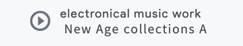

simple audio button

### Usage
```dart

class AudioResources{
  static int calc(int minute, int second) => minute * 60 + second;
  static AudioModel electronicalA = AudioModel(
      url: 'assets/audio/myMusic_electronicalA.mp3', //fixme: change to A
      title: 'electronical music work - New Age collections A',
      length: 478.952836
  );
  static AudioModel electronicalB = AudioModel(
      url: 'assets/audio/myMusic_electronicalB.mp3', //'http://sites.google.com/site/yandusite/images/images/myMusic_electronicalB.mp3',
      title: 'electronical music work - techno collections A',
      length: 478.952836
  );
  static AudioModel gameTrack = AudioModel(
      url: 'assets/audio/myMusic_electronicalC.mp3', //'http://sites.google.com/site/yandusite/images/images/myMusic_electronicalC.mp3',
      title: 'electronical music work - gameTrack',
      length: 478.952836
  );

  static AudioModel school = AudioModel(
      url: 'assets/audio/myMusic_highschollWork.mp3', //'http://sites.google.com/site/yandusite/images/images/myMusic_highschollWork.mp3',
      title: 'electronical music work - high school work',
      length: 478.952836
  );
}

class Example{
  SimpleAudioButton audioBt({AudioModel model, double width, Key key}) {
    return SimpleAudioButton(
      model,
      width: width,
      onPress: onPlayerPressed,
      awareness: () => group.awareness,
      key: key,
      spinIcon: CustomIcons.spin4,
      activeIconColor: MColors.textAccent,
      inactiveIconColor: MColors.skillText,
      literalStyle: TextStyles.p,
      accentStyle: TextStyles.bodyAccent,
      boldStyle: TextStyles.bodyBold,
      progressBgColor: MColors.audioProgressBg.withOpacity(0.15),
      inProgressColor: MColors.textAccent,
    );
  }

  Widget buildMusicControls() {
    final w = section.constraints.maxWidth;
    _D.debug('rebuild _SkillSectionMusicA, w: $w');

    try {
      return group = SimpleAudioGroup<AudioModel>(
          key: Keys.skillMusicAudioGroup,
          resources: [
            AudioResources.electronicalA,
            AudioResources.electronicalB,
            AudioResources.gameTrack,
            AudioResources.school
          ],
          builder: (ctx, resources) {
            _buttons ??= <SimpleAudioButton>[
              audioBt(
                  model: resources[0],
                  width: w / 2,
                  key: Keys.skillMusicAudioGroupS1),
              audioBt(
                  model: resources[1],
                  width: w / 2,
                  key: Keys.skillMusicAudioGroupS2),
              audioBt(
                  model: resources[2],
                  width: w / 2,
                  key: Keys.skillMusicAudioGroupS3),
              audioBt(
                  model: resources[3],
                  width: w / 2,
                  key: Keys.skillMusicAudioGroupS4),
            ];

            _responsiveMediumLarge ??=
                Column(crossAxisAlignment: CrossAxisAlignment.start, children: [
                  Row(
                      mainAxisAlignment: MainAxisAlignment.start,
                      crossAxisAlignment: CrossAxisAlignment.center,
                      children: [
                        Expanded(
                          child: _buttons[0],
                        ),
                        Expanded(
                          child: _buttons[1],
                        )
                      ]),
                  Row(
                      mainAxisAlignment: MainAxisAlignment.start,
                      crossAxisAlignment: CrossAxisAlignment.center,
                      children: [
                        Expanded(
                          child: _buttons[2],
                        ),
                        Expanded(
                          child: _buttons[3],
                        )
                      ]),
                ]);

            _responsiveSmall ??=
                Column(crossAxisAlignment: CrossAxisAlignment.start, children: [
                  Row(
                      mainAxisAlignment: MainAxisAlignment.start,
                      crossAxisAlignment: CrossAxisAlignment.center,
                      children: [
                        Expanded(
                          child: _buttons[0],
                        )
                      ]),
                  Row(
                      mainAxisAlignment: MainAxisAlignment.start,
                      crossAxisAlignment: CrossAxisAlignment.center,
                      children: [
                        Expanded(
                          child: _buttons[1],
                        )
                      ]),
                  Row(
                      mainAxisAlignment: MainAxisAlignment.start,
                      crossAxisAlignment: CrossAxisAlignment.center,
                      children: [
                        Expanded(
                          child: _buttons[2],
                        )
                      ]),
                  Row(
                      mainAxisAlignment: MainAxisAlignment.start,
                      crossAxisAlignment: CrossAxisAlignment.center,
                      children: [
                        Expanded(
                          child: _buttons[3],
                        )
                      ]),
                ]);
            return ResponsiveElt(
                large: _responsiveMediumLarge,
                small: _responsiveSmall,
                media: TRWMedia.fromConstaints(section.constraints),
                responsiveSize: SIZE_SKILLAUDIO);
          });
    } catch (e, s) {
      _D.debug('[ERROR] _SkillSectionMusic.buildMusicControls failed: $e\n$s');
      rethrow;
    }
  }
}
```

